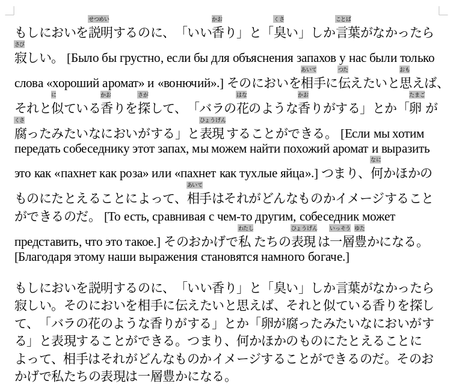

# Скрипт подготовки японского текста для чтения по методу Ильи Франка для LibreOffice

Инструмент для автоматической подготовки японских текстов к чтению по методу Ильи Франка с использованием LLM и LibreOffice Writer. Скрипт автоматически преобразует текст с фуриганой в формат ruby-текста LibreOffice.

## Обзор

Этот инструмент помогает подготовить японские тексты для чтения по методу Ильи Франка:
1. Использует LLM для добавления фуриганы (произношения, написанного над иероглифами) к японскому тексту
2. Преобразует аннотированный текст в правильное форматирование ruby в LibreOffice
3. Поддерживает как полноширинные （） так и обычные () скобки для фуриганы

## Пример работы программы



## Рабочий процесс

### Этап 1: Обработка текста с помощью LLM

#### Рекомендуемые модели

- **Высокое качество:** Claude Sonnet 4, ChatGPT O3, Gemini 2.5 Pro
- **Бюджетные варианты:** GPT-4 Mini, DeepSeek R1, Qwen3 235B A22B, Llama 4 Maverick

#### Процесс работы

1. **Подготовка запроса:** Возьмите промпт из файла `PROMPT.txt` и добавьте к нему ваш японский текст
2. **Отправка в LLM:** Отправьте подготовленный запрос выбранной модели
   - Для DeepSeek: включите переключатель "DeepSeek (R1)" перед отправкой
3. **Обязательная проверка:** Подайте результат работы LLM другой модели (или той же) с запросом:
   - "Проверь следующий текст — правильно ли в скобках （） дано произношение?"
   - Или: "Перепроверь произношение, указанное в скобках （）, выведи список найденных ошибок вместе с правильным вариантом"
   - Затем: "Выведи полный результат с указанными исправлениями"

> **Важно:** Всегда проверяйте результат работы LLM, так как модели часто делают ошибки в произношении

### Этап 2: Обработка в LibreOffice

1. Вставьте обработанный LLM текст в LibreOffice Writer
2. Запустите скрипт конвертации фуриганы
3. Текст готов для чтения или печати

## Установка

### Linux

#### Предварительные требования
```bash
sudo apt install libreoffice-script-provider-python
mkdir -p ~/.config/libreoffice/4/user/Scripts/python
```

#### Установка скрипта
```bash
cp furigana_convert.py ~/.config/libreoffice/4/user/Scripts/python/
```

### Windows

#### Предварительные требования
1. Убедитесь, что LibreOffice установлен с поддержкой Python
2. При установке LibreOffice выберите компонент "Python Scripting Support"

#### Установка скрипта
1. Найдите папку пользовательских скриптов LibreOffice:
   ```
   %APPDATA%\LibreOffice\4\user\Scripts\python\
   ```
   Полный путь обычно выглядит как:
   ```
   C:\Users\[ИмяПользователя]\AppData\Roaming\LibreOffice\4\user\Scripts\python\
   ```

2. Если папка не существует, создайте её:
   - Откройте Проводник Windows
   - Вставьте в адресную строку: `%APPDATA%\LibreOffice\4\user\Scripts\`
   - Создайте папку `python` если её нет

3. Скопируйте файл `furigana_convert.py` в эту папку

#### Альтернативный способ для Windows
1. Откройте LibreOffice Writer
2. Перейдите в **Tools → Macros → Organize Macros → Python...**
3. В диалоге выберите **My Macros → user**
4. Нажмите **New...** и создайте модуль с именем `furigana_convert`
5. Скопируйте содержимое файла `furigana_convert.py` в редактор

### Структура после установки
```
My Macros
  └── user
        └── furigana_convert.py
```

**Важно:** Перезапустите LibreOffice после установки. LibreOffice сканирует скрипты только при запуске.

## Настройка интерфейса

### Добавление кнопки на панель инструментов

1. Откройте LibreOffice Writer
2. Перейдите в **Tools → Customize...**
3. Выберите вкладку **Toolbars**
4. В поле **Toolbar** выберите панель для добавления кнопки:
   - **Standard** (стандартная панель)
   - **Formatting**, **Table** и др.
   - Или нажмите **New...** для создания собственной панели "Furigana"
5. Нажмите **Add...**
6. В диалоге "Add Commands":
   - В списке **Category** найдите **Macros** (в самом низу списка)
   - Перейдите к: **My Macros → user → furigana_convert.py → furigana_convert**
   - Нажмите **Add**
7. Настройте внешний вид кнопки:
   - Выделите команду в списке → **Modify**
   - **Rename...** — задайте название (например, "Фуригана")
   - **Change Icon...** — выберите иконку или импортируйте свою (16×16px)
   - **Text only / Icon and text** — выберите способ отображения
8. Нажмите **OK**

### Добавление горячей клавиши (опционально)

1. В том же диалоге **Tools → Customize** выберите вкладку **Keyboard**
2. В поле **Shortcut Keys** выберите свободную комбинацию (например, **Ctrl+Shift+J**)
3. В разделе **Category** найдите: **Macros → My Macros → user → furigana_convert.py**
4. Выделите **furigana_convert** и нажмите **Modify**
5. Нажмите **OK**

### Тестирование

Введите в документ текст вида `日本語（にほんご）` и нажмите созданную кнопку. Текст должен преобразоваться в правильное ruby-форматирование.

## Перенос на другой компьютер

1. Скопируйте файл `furigana_convert.py` в соответствующую папку на новой системе:
   - **Linux:** `~/.config/libreoffice/4/user/Scripts/python/`
   - **Windows:** `%APPDATA%\LibreOffice\4\user\Scripts\python\`
2. Повторите настройку кнопки на панели инструментов
   (Настройки панелей хранятся в профиле пользователя, а не в скрипте)

## Решение проблем

### "Macros" не видно в списке Category
Пункт **LibreOffice Macros → My Macros** находится в самом низу алфавитного списка Category:
- Прокрутите список Category до самого конца
- Расширьте окно "Add Commands" по высоте
- Если окно слишком узкое, древовидная структура может не отображаться

### Проблемы с DeepSeek и разделением абзацев
DeepSeek иногда плохо различает границы абзацев. Решение: вручную добавьте дополнительные переносы строк между абзацами для четкого разделения.

### Скрипт не появляется в меню
- Убедитесь, что файл скопирован в правильную папку
- Перезапустите LibreOffice полностью
- Проверьте, что установлена поддержка Python в LibreOffice

## Файлы проекта

- `furigana_convert.py` — основной скрипт для LibreOffice
- `PROMPT.txt` — шаблон промпта для LLM
- `README.md` — данная документация

## Лицензия

The Unlicense, то есть Public Domain
